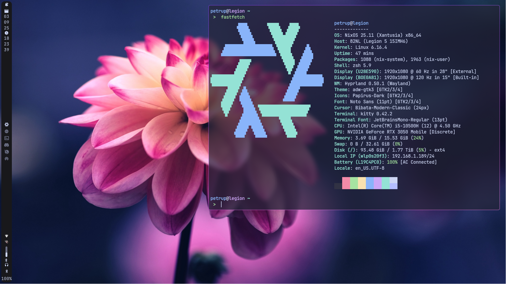

# ❄️ NixOS Configuration ❄️

This is my NixOS config built for a fast workflow and aesthetics.



## ✨ Features
- 🖥️ **Multiple Hosts Support**: Easy to configure for different hosts.
- 🎨 **Catpuccin Theme**: My favourite theme
- 🐚 **Zsh + tmux**: Shell setup with easy and fast navigation
- 🗒️ **Nixvim**: Near IDE experience
- 🪟 **Hyprland + Waybar**: No-nosence Hyprland config and a vertical Waybar

# 🚀 Installation

To get started with this setup, follow these steps:

1. **Install NixOS**: If you haven't already installed NixOS, follow the [NixOS Installation Guide](https://nixos.org/manual/nixos/stable/#sec-installation) for detailed instructions.
2. **Clone the Repository**:

	```bash
    git clone https://github.com/PeterPancake695/nixos-conf.git
    cd nixos-conf
    ```

3. **Copy one of the hosts configuration to set up your own**:

    ```bash
    cd hosts
    cp -r legion <your_hostname>
    cd <your_hostname>
    ```

4. **Put your `hardware-configuration.nix` file there**:

    ```bash
    cp /etc/nixos/hardware-configuration.nix ./
    ```

5. **Edit `hosts/<your_hostname>/local-packages.nix` and `nixos/packages.nix` files if needed**:

    ```bash
    vim local-packages.nix
    vim ../../nixos/packages.nix
    ```

6. **Finally, edit the `flake.nix` file**:

    ```diff
    ...
      outputs = { self, nixpkgs, home-manager, ... }@inputs: let
        system = "x86_64-linux";
    --  homeStateVersion = "25.05";
    ++  homeStateVersion = "<your_home_manager_state_version>";
    --  user = "petrup";
    ++  user = "<your_username>";
        hosts = [
    --    { hostname = "legion"; stateVersion = "25.05"; }
    ++    { hostname = "<your_hostname>"; stateVersion = "<your_state_version>"; }
        ];
    ...
    ```

7. **Rebuilding**:

    ```bash
    cd nixos-conf
    git add .
    doas nixos-rebuild switch --flake ./#<hostname>
    # or nixos-install --flake ./#<hostname> if you are installing on a fresh system
    home-manager switch --flake .
    ```

## 😎 Enjoy!


## 🤝 Contributions

Feel free to fork the repository and submit pull requests if you'd like to contribute improvements. Open issues if you encounter any problems with the config or have ideas for new features.

## ❤️ Credit

I heavily inspired my config on this [Config](https://github.com/Andrey0189/nixos-config-reborn.git) by Andrey0189. Special thx to him and to the King, the Legend, Terry A. Davis
